# E-Voting-System
```
Febriyani Nurhida
312210222
TI.22.A2
```

# Berikut adalah program yang sudah saya buat:
## E-Voting System
### 1. Login voter
```
<!DOCTYPE html>
<html>
<head>
    <title>Halaman Login</title>
    <link rel="stylesheet" type="text/css" href="style.css">
</head>
<style>
    /* style.css */

body {
    margin: 0;
    padding: 0;
    font-family: 'Arial', sans-serif;
    background-color: #f8f9fa;
}

.container {
    width: 300px;
    margin: 100px auto;
    padding: 20px;
    background-color: #ffffff;
    box-shadow: 0 0 10px rgba(0, 0, 0, 0.1);
    border-radius: 8px;
    text-align: center;
}

h2 {
    color: #333;
}

form {
    display: flex;
    flex-direction: column;
}

input {
    width: 100%;
    padding: 10px;
    margin: 10px 0;
    border: 1px solid #ccc;
    border-radius: 4px;
}

button {
    background-color: rgb(136, 209, 255);
    color: #000000;
    border: 1px solid white;
    padding: 10px 20px;
    font-size: 1rem;
    cursor: pointer;
    border-radius: 4px;
}

button:hover {
    background-color: rgb(136, 209, 255);
    color: #ffffff;
}

</style>
<body>
    <div class="container">
        <h2>Silakan Login</h2>
        <form action="index.html" method="post">
            <input type="text" name="username" placeholder="Username" required>
            <input type="password" name="password" placeholder="Password" required>
            <button type="submit">Login</button>
        </form>
    </div>
</body>
</html>
```
 ### outputnya :
 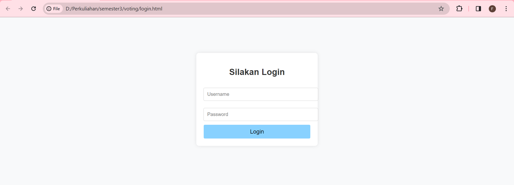

 ### Tampilan Dashboard
 ```
 <!DOCTYPE html>
<html lang="en">

<head>
    <meta charset="UTF-8">
    <meta name="viewport" content="width=device-width, initial-scale=1.0">
    <title>E-Voting</title>
    <link rel="stylesheet" href="css/custom_style.css">
    <link rel="icon" href="images/icon.png" type="image/x-icon">
</head>
<style>
    /* Add your custom styles here */

body {
    margin: 0;
    padding: 0;
    font-family: 'Arial', sans-serif;
}

.navbar {
    background-color: rgb(136, 209, 255);;
    padding: 10px;
}

.navbar-brand {
    color: white;
    font-size: 1.5rem;
    font-weight: bold;
}

.navbar-brand img {
    max-height: 40px;
    margin-right: 10px;
}

.navbar-toggler {
    border: none;
}

.nav-link {
    color: white !important;
}

.btn-light {
    background-color: rgb(136, 209, 255);;
    color: #000000;
    border: 1px solid white;
    padding: 10px 20px;
    font-size: 1rem;
}

.btn-light:hover {
    background-color: rgb(136, 209, 255);;
    color: #ffffff;
}

#hero {
    padding: 80px 0;
    background-color: #f8f9fa;
}

#hero h2 {
    font-size: 2.5rem;
    color: #333;
}

#ilustrasi img {
    max-width: 100%;
}

#kades {
    padding: 80px 0;
    background-color: #ffffff;
}

.card {
    margin-bottom: 20px;
}

.card-title {
    font-size: 1.5rem;
    font-weight: bold;
}

.footer-bawah {
    background-color: rgb(136, 209, 255);
    color: white;
    padding: 20px 0;
}
.card img {
            max-width: 100%;
            height: auto;
            max-height: 200px; /* You can adjust this value based on your preference */
        }

</style>
<body>

    <!-- Navbar -->
    <nav class="py-2 navbar navbar-expand-lg fixed-top">
        <div class="container">
            <a class="navbar-brand" href="#">
                
                E-Voting
            </a>
            <button class="navbar-toggler navbar-dark" type="button" data-bs-toggle="collapse" data-bs-target="#navbarSupportedContent"
                aria-controls="navbarSupportedContent" aria-expanded="false" aria-label="Toggle navigation">
                <span class="navbar-toggler-icon"></span>
            </button>
            <div class="collapse navbar-collapse justify-content-end" id="navbarSupportedContent">
                <ul class="navbar-nav ml-auto">
                    <li class="nav-item">
                        <a class="nav-link active" aria-current="page" href="profile.html">Profile</a>
                    </li>
                    <li class="nav-item">
                        <a class="nav-link" href="voting.html">Voting</a>
                    </li>
                    <li class="nav-item">
                        <a class="nav-link" href="hasil.html">Hasil</a>
                    </li>
                    <li class="nav-item">
                        <a class="nav-link" href="admin-login.html">Admin</a>
                    </li>
                </ul>
            </div>
        </div>
    </nav>
    <!-- END Navbar -->

    <!-- Hero Section -->
    <section id="hero">
        <div class="container">
            <div class="row">
                <div class="col">
                    <h2>Berikan Suaramu Sekarang Demi Kemajuan Bangsa dan Negara</h2>
                    <button type="button" class="btn btn-light" onclick="location.href='voting.html'">
                        <strong>Vote Sekarang</strong>
                    </button>
                </div>
                <div class="col-5 img-col" id="ilustrasi">
                    
                </div>
            </div>
        </div>
    </section>
    <!-- END Hero Section -->

    <!-- Kades Section -->
    <section id="kades">
        <div class="container">
            <div class="deskripsi text-center">
                <h2>Apa itu E-Voting?</h2>
                <p>E-Voting adalah sebuah web sarana pemungutan suara dalam rangkaian <br> proses pemilu yang dilakukan secara
                    online.</p>
            </div>
            <div class="row row-cols-1 row-cols-md-3 g-4">
                <div class="col">
                    <div class="card">
                        
                        <div class="card-body">
                            <h5 class="card-title">Suthanos</h5>
                            <p class="card-text">Calon yang berasal dari RT 03 RW 09 ini memiliki hobi menanam
                                terong. Sehingga warna kulitnya sendiri dicat sewarna dengan terong.</p>
                        </div>
                    </div>
                </div>
                <div class="col">
                    <div class="card">
                        
                        <div class="card-body">
                            <h5 class="card-title">Tony Sutorak</h5>
                            <p class="card-text">Selain memiliki predikat S3 Teknik Mesin Robot, dia juga seringkali membantu
                                masyarakat melakukan service elektronik secara gratis dan juga sering mengadakan giveaway
                                obeng.</p>
                        </div>
                    </div>
                </div>
                <div class="col">
                    <div class="card">
                        
                        <div class="card-body">
                            <h5 class="card-title">Hulak</h5>
                            <p class="card-text">Seorang yang memiliki rumah di pinggiran desa. Hal ini dikarenakan sawah
                                yang dimilikinya sangat luas. Dia adalah seorang Vegan sehingga warna kulitnya menjadi
                                hijau</p>
                        </div>
                    </div>
                </div>
            </div>
        </div>
    </section>
    <!-- END Kades Section -->

    <!-- Profile Developer -->
    <div class="text-center p-3 footer-bawah">
        <h5>Developed by</h5>
        <p><small>Febriyani Nurhida</small></p>
    </div>
    <!-- END Profile Developer -->

    <!-- Javascript -->
    <script src="../node_modules/bootstrap/dist/js/bootstrap.bundle.js"></script>
<!-- ... (your existing code) ... -->

<script>
    // Check user's login status
    async function checkLoginStatus() {
        try {
            const response = await fetch('/check-login', { method: 'GET' }); // Replace with your actual endpoint
            const data = await response.json();

            // Assuming your server responds with a boolean indicating login status
            const isLoggedIn = data.isLoggedIn;

            if (!isLoggedIn) {
                window.location.href = 'login.html';
            }
        } catch (error) {
            console.error('Error checking login status:', error);
        }
    }

    // Call the function when the page loads
    checkLoginStatus();
</script>

</body>

</html>
``` 

### outputnya :
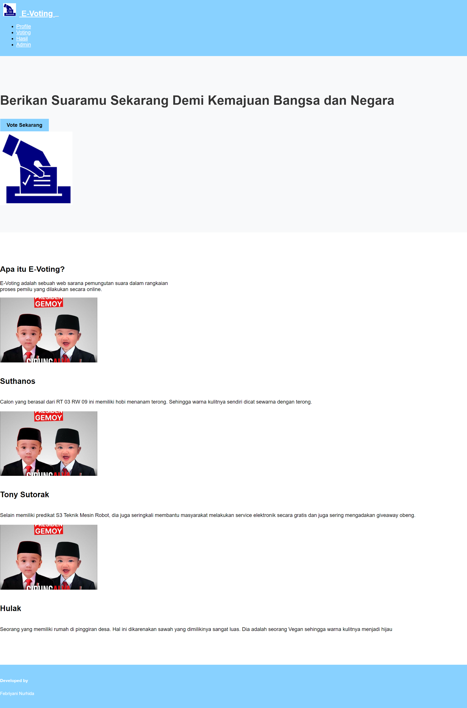

### tampilan profile
```
<!DOCTYPE html>
<html lang="en">

<head>
    <meta charset="UTF-8">
    <meta name="viewport" content="width=device-width, initial-scale=1.0">
    <title>E-Voting - Profile</title>
    <link rel="stylesheet" href="css/custom_style.css">
    <link rel="icon" href="images/icon.png" type="image/x-icon">
</head>

<style>
    /* Add your custom styles here */

    body {
        margin: 0;
        padding: 0;
        font-family: 'Arial', sans-serif;
    }

    .navbar {
        background-color: rgb(136, 209, 255);;
        padding: 10px;
    }

    .navbar-brand {
        color: white;
        font-size: 1.5rem;
        font-weight: bold;
    }

    .navbar-brand img {
        max-height: 40px;
        margin-right: 10px;
    }

    .navbar-toggler {
        border: none;
    }

    .nav-link {
        color: white !important;
    }

    .btn-light {
        background-color: rgb(136, 209, 255);;
        color: #000000;
        border: 1px solid white;
        padding: 10px 20px;
        font-size: 1rem;
    }

    .btn-light:hover {
        background-color: rgb(136, 209, 255);;
        color: #ffffff;
    }

    #hero {
        padding: 80px 0;
        background-color: #f8f9fa;
    }

    #hero h2 {
        font-size: 2.5rem;
        color: #333;
    }

    #ilustrasi img {
        max-width: 100%;
    }

    #profile {
        padding: 80px 0;
        background-color: #ffffff;
    }

    .profile-content {
        text-align: center;
        max-width: 600px;
        margin: 0 auto;
    }

    .profile-img {
        max-width: 200px;
        border-radius: 50%;
        margin-bottom: 20px;
    }

    .footer-bawah {
        background-color: rgb(136, 209, 255);
        color: white;
        padding: 20px 0;
    }
</style>

<body>

    <!-- Navbar -->
    <nav class="py-2 navbar navbar-expand-lg fixed-top">
        <div class="container">
            <a class="navbar-brand" href="#">
                
                E-Voting
            </a>
            <button class="navbar-toggler navbar-dark" type="button" data-bs-toggle="collapse" data-bs-target="#navbarSupportedContent"
                aria-controls="navbarSupportedContent" aria-expanded="false" aria-label="Toggle navigation">
                <span class="navbar-toggler-icon"></span>
            </button>
            <div class="collapse navbar-collapse justify-content-end" id="navbarSupportedContent">
                <ul class="navbar-nav ml-auto">
                    <li class="nav-item">
                        <a class="nav-link" href="profile.html">Profile</a>
                    </li>
                    <li class="nav-item">
                        <a class="nav-link" href="voting.html">Voting</a>
                    </li>
                    <li class="nav-item">
                        <a class="nav-link" href="hasil.html">Hasil</a>
                    </li>
                    <li class="nav-item">
                        <a class="nav-link" href="admin-login.html">Admin</a>
                    </li>
                </ul>
            </div>
        </div>
    </nav>

    <section id="hero">
        <div class="container">
            <div class="row justify-content-center align-items-center"> 
                <div class="col text-center">
                    <h2>Welcome to Your Profile</h2>
                </div>
            </div>
        </div>
    </section>

    <section id="profile">
        <div class="container">
            <div class="profile-content">
                
                <h2>Muhammad DoKyeongseo</h2>
                <p>NIK: Your 312210222</p>
                <p>Address: Jalan Terus Bersamamu</p>
                <p>Date of Birth (TTL): 12 Januari 1993</p>
                <p>Election Status: Pemilih Tetap</p>
            </div>
        </div>
    </section>
    <!-- END Profile Section -->

    <!-- Footer -->
    <div class="text-center p-3 footer-bawah">
        <h5>Developed by</h5>
        <p><small>Mohammad Adiyudha Wisnu Wardana - Satria Galang Saputra - Yustika Rahma</small></p>
    </div>
    <!-- END Footer -->

</body>

</html>
```

### outputnya:
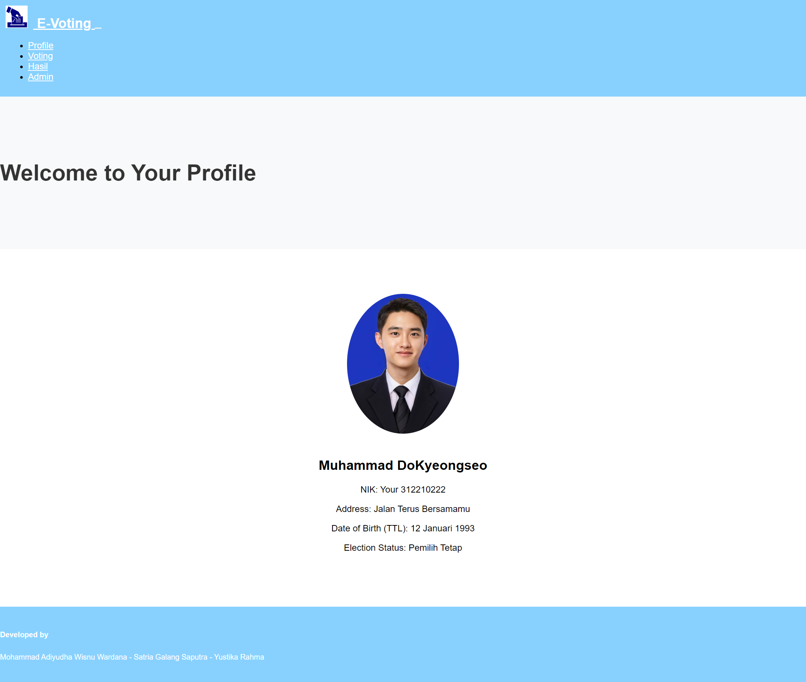

### Melakukan Voting
```
<!DOCTYPE html>
<html lang="en">

<head>
    <meta charset="UTF-8">
    <meta name="viewport" content="width=device-width, initial-scale=1.0">
    <title>E-Voting - Voting</title>
    <link rel="stylesheet" href="css/custom_style.css">
    <link rel="icon" href="images/icon.png" type="image/x-icon">
</head>
<style>
   /* Add your custom styles here */

body {
    font-family: 'Arial', sans-serif;
    margin: 0;
    padding: 0;
    background-color: #f8f9fa;
    color: #333;
}

.container {
    max-width: 800px;
    margin: 0 auto;
}

.header {
    text-align: center;
    margin-top: 50px;
}

.form-container {
    background-color: #fff;
    padding: 20px;
    border-radius: 8px;
    box-shadow: 0 0 10px rgba(0, 0, 0, 0.1);
    margin-top: 20px;
}

.form-group {
    margin-bottom: 20px;
}

.form-group label {
    display: block;
    font-size: 1.2rem;
    font-weight: bold;
}

.form-group input[type="text"],
.form-group input[type="number"],
.form-group select {
    width: 100%;
    padding: 10px;
    border: 1px solid #ccc;
    border-radius: 4px;
}

.btn-primary {
    background-color: #007bff;
    color: #fff;
    padding: 10px 20px;
    border: none;
    border-radius: 4px;
    cursor: pointer;
}

.btn-primary:hover {
    background-color: #0056b3;
}
</style> 
<body>
    <div class="container">
        <div class="header">
            <h1>Voting Page</h1>
        </div>

        <div class="form-container">
            <form action="#" method="post" id="votingForm">
                <div class="form-group">
                    <label for="candidate">Choose Candidate:</label>
                    <select id="candidate" name="candidate" required>
                        <option value="suthanos">Suthanos</option>
                        <option value="tony">Tony Sutorak</option>
                        <option value="hulak">Hulak</option>
                    </select>
                </div>

                <div class="form-group">
                    <label for="vote-comment">Comments (optional):</label>
                    <input type="text" id="vote-comment" name="vote-comment">
                </div>

                <button type="button" class="btn btn-primary" onclick="submitForm()">Vote Now</button>
            </form>
        </div>
    </div>

    <script>
        function submitForm() {
            // You can add validation or other actions before submitting the form
            document.getElementById('votingForm').submit();
        }
    </script>
</body>

</html>
```

### outputnya:
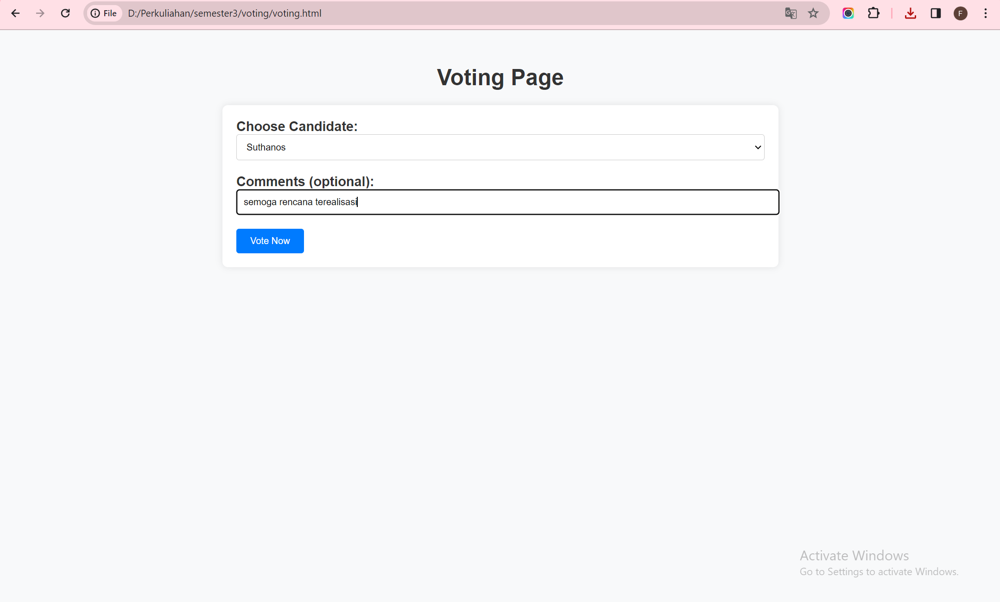

### Voter Melihat Result Sementara
```
<!DOCTYPE html>
<html lang="en">

<head>
    <meta charset="UTF-8">
    <meta name="viewport" content="width=device-width, initial-scale=1.0">
    <title>E-Voting - Hasil</title>
    <link rel="stylesheet" href="css/custom_style.css">
    <link rel="icon" href="images/icon.png" type="image/x-icon">
</head>

<style>
    /* Add your custom styles here */

    body {
        margin: 0;
        padding: 0;
        font-family: 'Arial', sans-serif;
    }

    .navbar {
        background-color: rgb(136, 209, 255);
        padding: 10px;
    }

    .navbar-brand {
        color: white;
        font-size: 1.5rem;
        font-weight: bold;
    }

    .navbar-brand img {
        max-height: 40px;
        margin-right: 10px;
    }

    .navbar-toggler {
        border: none;
    }

    .nav-link {
        color: white !important;
    }

    .btn-light {
        background-color: rgb(136, 209, 255);
        color: #000000;
        border: 1px solid white;
        padding: 10px 20px;
        font-size: 1rem;
    }

    .btn-light:hover {
        background-color: rgb(136, 209, 255);
        color: #ffffff;
    }

    #hero {
        padding: 80px 0;
        background-color: #f8f9fa;
    }

    #hero h2 {
        font-size: 2.5rem;
        color: #333;
    }

    #hasil {
        padding: 80px 0;
        background-color: #ffffff;
    }

    .result-content {
        text-align: center;
        max-width: 600px;
        margin: 0 auto;
    }

    .footer-bawah {
        background-color: rgb(136, 209, 255);
        color: white;
        padding: 20px 0;
    }
</style>

<body>

    <!-- Navbar -->
    <nav class="py-2 navbar navbar-expand-lg fixed-top">
        <div class="container">
            <a class="navbar-brand" href="#">
                
                E-Voting
            </a>
            <button class="navbar-toggler navbar-dark" type="button" data-bs-toggle="collapse" data-bs-target="#navbarSupportedContent"
                aria-controls="navbarSupportedContent" aria-expanded="false" aria-label="Toggle navigation">
                <span class="navbar-toggler-icon"></span>
            </button>
            <div class="collapse navbar-collapse justify-content-end" id="navbarSupportedContent">
                <ul class="navbar-nav ml-auto">
                    <li class="nav-item">
                        <a class="nav-link" href="profile.html">Profile</a>
                    </li>
                    <li class="nav-item">
                        <a class="nav-link" href="voting.html">Voting</a>
                    </li>
                    <li class="nav-item">
                        <a class="nav-link active" aria-current="page" href="hasil.html">Hasil</a>
                    </li>
                    <li class="nav-item">
                        <a class="nav-link" href="admin-login.html">Admin</a>
                    </li>
                </ul>
            </div>
        </div>
    </nav>
    <!-- END Navbar -->

    <!-- Hero Section -->
    <section id="hero">
        <div class="container">
            <div class="row justify-content-center align-items-center"> <!-- Center both horizontally and vertically -->
                <div class="col text-center">
                    <h2>Election Results</h2>
                </div>
            </div>
        </div>
    </section>
    <!-- END Hero Section -->

    <!-- Hasil Section -->
    <section id="hasil">
        <div class="container">
            <div class="result-content">
                <!-- Your election results content goes here -->
                <p>Result 1: Candidate A - Votes: XXX</p>
                <p>Result 2: Candidate B - Votes: XXX</p>
                <p>Result 3: Candidate C - Votes: XXX</p>
                <!-- Add more results as needed -->
            </div>
        </div>
    </section>
    <!-- END Hasil Section -->

    <!-- Footer -->
    <div class="text-center p-3 footer-bawah">
        <h5>Developed by</h5>
        <p><small>Febriyani Nurhida</small></p>
    </div>
    <!-- END Footer -->

</body>

</html>
```

### outputnya:
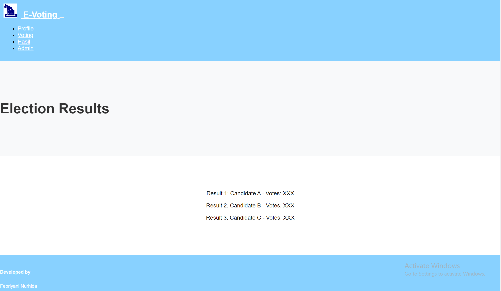

### Log-in sebagai admin
```
<!DOCTYPE html>
<html lang="en">

<head>
    <meta charset="UTF-8">
    <meta name="viewport" content="width=device-width, initial-scale=1.0">
    <title>E-Voting - Admin Login</title>
    <link rel="stylesheet" href="css/custom_style.css">
    <link rel="icon" href="images/icon.png" type="image/x-icon">
</head>

<style>
    /* Add your custom styles here */

    body {
        margin: 0;
        padding: 0;
        font-family: 'Arial', sans-serif;
    }

    .admin-login {
        background-color: #f8f9fa;
        padding: 80px 0;
    }

    .login-box {
        max-width: 400px;
        margin: 0 auto;
        background: #fff;
        padding: 20px;
        border-radius: 8px;
        box-shadow: 0 0 10px rgba(0, 0, 0, 0.1);
    }

    .login-box h2 {
        text-align: center;
        margin-bottom: 20px;
    }

    .login-box .form-group {
        margin-bottom: 20px;
    }

    .login-box label {
        font-size: 18px;
        display: block;
        margin-bottom: 8px;
    }

    .login-box input {
        width: 100%;
        padding: 10px;
        font-size: 16px;
        border-radius: 5px;
        border: 1px solid #ddd;
    }

    .login-box button {
        width: 100%;
        padding: 10px;
        font-size: 18px;
        border-radius: 5px;
        background: rgb(136, 209, 255);
        color: #fff;
        border: none;
        cursor: pointer;
    }

    .login-box button:hover {
        background: #4578a0;
    }

    .footer-bawah {
        background-color: rgb(136, 209, 255);
        color: white;
        padding: 20px 0;
        position: fixed;
        width: 100%;
        bottom: 0;
        text-align: center;
    }
</style>

<body>

    <!-- Admin Login Section -->
    <section class="admin-login">
        <div class="login-box">
            <h2>Admin Login</h2>
            <form action="admin-dashboard.html" method="post">
                <div class="form-group">
                    <label for="username">Username:</label>
                    <input type="text" name="username" id="username" required>
                </div>
                <div class="form-group">
                    <label for="password">Password:</label>
                    <input type="password" name="password" id="password" required>
                </div>
                <button type="submit">Login</button>
            </form>
        </div>
    </section>
    <!-- END Admin Login Section -->

    <!-- Footer -->
    <div class="footer-bawah">
        <p>Developed by Febriyani Nurhida</p>
    </div>
    <!-- END Footer -->

</body>

</html>
```

### outputnya:
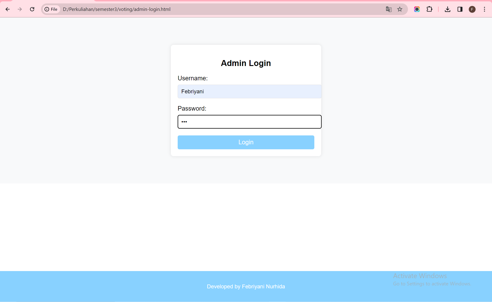

### dashboard admin
```
<!DOCTYPE html>
<html lang="en">

<head>
    <meta charset="UTF-8">
    <meta name="viewport" content="width=device-width, initial-scale=1.0">
    <title>E-Voting - Admin Dashboard</title>
    <link rel="stylesheet" href="css/custom_style.css">
    <link rel="icon" href="images/icon.png" type="image/x-icon">
</head>

<style>
    /* Add your custom styles here */

    body {
        margin: 0;
        padding: 0;
        font-family: 'Arial', sans-serif;
    }

    .navbar {
        background-color: rgb(136, 209, 255);
        padding: 10px;
    }

    .navbar-brand {
        color: white;
        font-size: 1.5rem;
        font-weight: bold;
    }

    .navbar-brand img {
        max-height: 40px;
        margin-right: 10px;
    }

    .navbar-toggler {
        border: none;
    }

    .nav-link {
        color: white !important;
    }

    .admin-dashboard {
        display: flex;
        flex-direction: column;
        align-items: center;
        justify-content: center;
        padding: 80px 0;
        background-color: #f8f9fa;
    }

    .dashboard-content {
        text-align: center;
        max-width: 600px;
    }

    .dashboard-img {
        max-width: 200px;
        border-radius: 50%;
        margin-bottom: 20px;
    }

    .dashboard-content h2 {
        margin-bottom: 20px;
    }

    .dashboard-section-container {
        display: flex;
        flex-wrap: wrap;
        justify-content: center;
        gap: 20px;
        max-width: 800px;
    }

    .dashboard-section {
        text-align: left;
        padding: 20px;
        background-color: #ffffff;
        box-shadow: 0 0 10px rgba(0, 0, 0, 0.1);
        border-radius: 8px;
        flex: 0 1 300px;
    }

    .dashboard-section h3 {
        margin-bottom: 10px;
    }

    .btn-primary {
        background-color: rgb(136, 209, 255);
        color: #000000;
        border: 1px solid white;
        padding: 10px 20px;
        font-size: 1rem;
        text-decoration: none;
        display: inline-block;
        border-radius: 4px;
        cursor: pointer;
    }

    .btn-primary:hover {
        background-color: rgb(136, 209, 255);
        color: #ffffff;
    }

    .footer-bawah {
        background-color: rgb(136, 209, 255);
        color: white;
        padding: 20px 0;
        text-align: center;
    }
</style>

<body>

    <!-- Navbar -->
    <nav class="py-2 navbar navbar-expand-lg fixed-top">
        <div class="container">
            <a class="navbar-brand" href="#">
                
                E-Voting
            </a>
            <button class="navbar-toggler navbar-dark" type="button" data-bs-toggle="collapse" data-bs-target="#navbarSupportedContent"
                aria-controls="navbarSupportedContent" aria-expanded="false" aria-label="Toggle navigation">
                <span class="navbar-toggler-icon"></span>
            </button>
            <div class="collapse navbar-collapse justify-content-end" id="navbarSupportedContent">
                <ul class="navbar-nav ml-auto">
                    <li class="nav-item">
                        <a class="nav-link" href="index.html">Dashboard</a>
                    </li>
                    <li class="nav-item">
                        <a class="nav-link" href="admin-result.html">Results</a>
                    </li>
                    <li class="nav-item">
                        <a class="nav-link" href="admin-logout.html">Logout</a>
                    </li>
                </ul>
            </div>
        </div>
    </nav>

    <!-- Admin Dashboard Section -->
    <section class="admin-dashboard">
        <div class="dashboard-content">
            
            <h2>Welcome to the Admin Dashboard</h2>
            <p>Manage the E-Voting system efficiently from this dashboard.</p>
        </div>

        <!-- Action Sections -->
        <div class="dashboard-section-container">
            <div class="dashboard-section">
                <h3>Candidate Management</h3>
                <p>Manage and add candidates for the election.</p>
                <a href="admin-manage-candidates.html" class="btn btn-primary">Manage Candidates</a>
            </div>

            <div class="dashboard-section">
                <h3>Voter Management</h3>
                <p>Manage registered voters for the election.</p>
                <a href="admin-manage-voters.html" class="btn btn-primary">Manage Voters</a>
            </div>

            <div class="dashboard-section">
                <h3>Election Results</h3>
                <p>View and analyze the election results.</p>
                <a href="admin-view-results.html" class="btn btn-primary">View Results</a>
            </div>
        </div>
    </section>

    <!-- Footer -->
    <div class="footer-bawah">
        <p>Developed by Febriyani Nurhida</p>
    </div>
    <!-- END Footer -->

</body>

</html>
```

### outputnya:

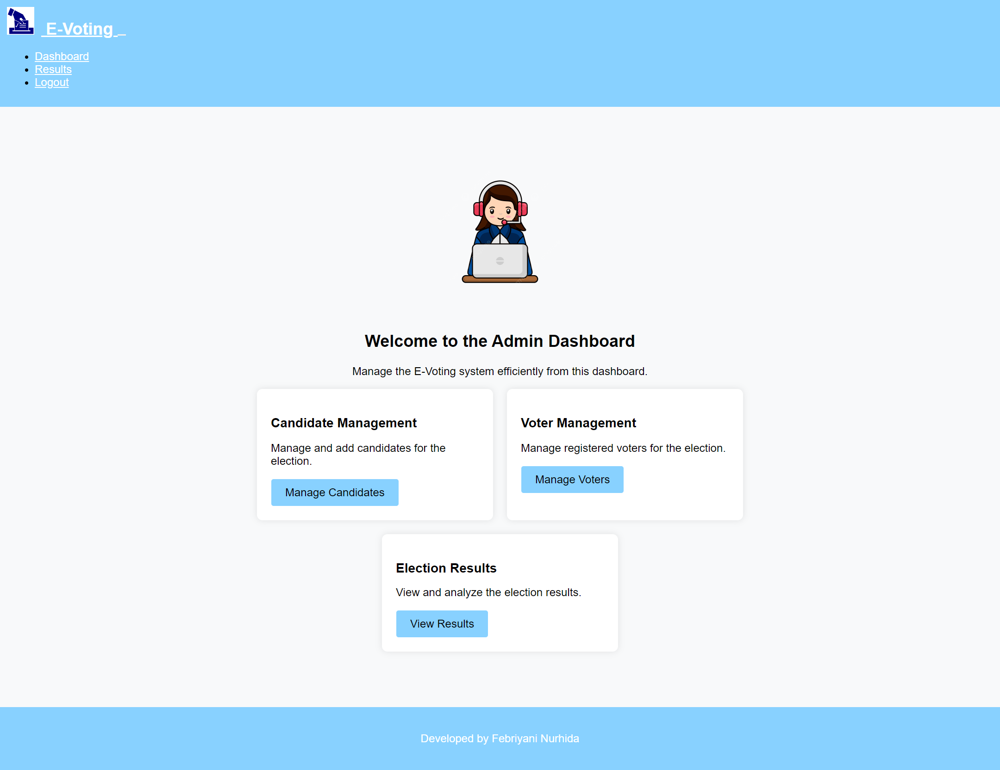

### admin me-manage candidate
```
<!DOCTYPE html>
<html lang="en">

<head>
    <meta charset="UTF-8">
    <meta name="viewport" content="width=device-width, initial-scale=1.0">
    <title>Manage Candidates - Admin Dashboard</title>
    <link rel="stylesheet" href="css/custom_style.css">
    <link rel="icon" href="images/icon.png" type="image/x-icon">
    <link rel="stylesheet" href="css/manage_candidates_style.css"> <!-- Add your CSS file for this specific page -->
</head>
<style>
    /* Add your custom styles for the manage candidates page here */
/* Add your custom styles for the manage candidates page here */

.admin-manage-candidates {
    padding: 80px 0;
    background-color: #f8f9fa;
}

.container {
    max-width: 800px;
    margin: 0 auto;
}

h2 {
    text-align: center;
}

.candidate-list {
    display: flex;
    flex-wrap: wrap;
    gap: 20px;
    justify-content: center;
}

.candidate-item {
    text-align: center;
    background-color: #ffffff;
    padding: 20px;
    box-shadow: 0 0 10px rgba(0, 0, 0, 0.1);
    border-radius: 8px;
}

.candidate-item img {
    max-width: 50%;
    height: auto;
    border-radius: 50%;
    margin-bottom: 10px;
}

.add-candidate-form {
    margin-top: 40px;
    text-align: center;
}

.add-candidate-form h3 {
    margin-bottom: 20px;
}

.add-candidate-form form {
    max-width: 400px;
    margin: 0 auto;
}

.add-candidate-form label {
    display: block;
    margin-bottom: 5px;
}

.add-candidate-form input {
    width: 100%;
    padding: 10px;
    margin-bottom: 15px;
    border: 1px solid #ccc;
    border-radius: 4px;
}

.add-candidate-form button {
    background-color: rgb(136, 209, 255);
    color: #000000;
    border: 1px solid white;
    padding: 10px 20px;
    font-size: 1rem;
    cursor: pointer;
    border-radius: 4px;
}

.add-candidate-form button:hover {
    background-color: rgb(136, 209, 255);
    color: #ffffff;
}


</style>
<body>

    <!-- Navbar -->
    <nav class="py-2 navbar navbar-expand-lg fixed-top">
        <!-- Navbar content goes here -->
    </nav>

    <!-- Page Content -->
    <section class="admin-manage-candidates">
        <div class="container">
            <h2>Candidate Management</h2>

            <!-- Candidate List -->
            <div class="candidate-list">
                <!-- Sample candidate item, you can repeat this block for each candidate -->
                <div class="candidate-item">
                    
                    <h3>John Doe</h3>
                    <p>Party: XYZ Party</p>
                    <button class="btn btn-danger">Delete</button>
                </div>

                <!-- Add more candidate items as needed -->

            </div>

            <!-- Add Candidate Form -->
            <div class="add-candidate-form">
                <h3>Add New Candidate</h3>
                <form action="#" method="post" enctype="multipart/form-data">
                    <label for="candidateName">Candidate Name:</label>
                    <input type="text" id="candidateName" name="candidateName" required>

                    <label for="party">Party:</label>
                    <input type="text" id="party" name="party" required>

                    <label for="photo">Candidate Photo:</label>
                    <input type="file" id="photo" name="photo" accept="image/*" required>

                    <button type="submit" class="btn btn-primary">Add Candidate</button>
                </form>
            </div>
        </div>
    </section>

    <!-- Footer -->
    <div class="footer-bawah">
        <!-- Footer content goes here -->
    </div>

</body>

</html>
```

### output:
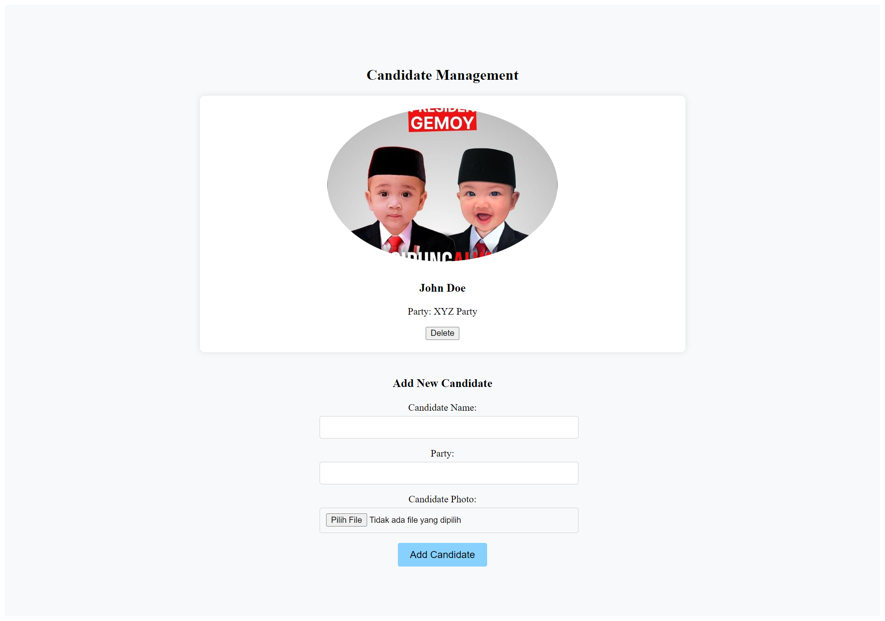

### admin me-manage voters
```
<!DOCTYPE html>
<html lang="en">

<head>
    <meta charset="UTF-8">
    <meta name="viewport" content="width=device-width, initial-scale=1.0">
    <title>Manage Voters - Admin Dashboard</title>
    <link rel="stylesheet" href="css/custom_style.css">
    <link rel="icon" href="images/icon.png" type="image/x-icon">
    <link rel="stylesheet" href="css/manage_voters_style.css"> <!-- Add your CSS file for this specific page -->
</head>
<style>
    /* Add your custom styles for the manage voters page here */

.admin-manage-voters {
    padding: 80px 0;
    background-color: #f8f9fa;
}

.container {
    max-width: 800px;
    margin: 0 auto;
}

h2 {
    text-align: center;
}

.voter-list {
    display: flex;
    flex-wrap: wrap;
    gap: 20px;
    justify-content: center;
}

.voter-item {
    text-align: center;
    background-color: #ffffff;
    padding: 20px;
    box-shadow: 0 0 10px rgba(0, 0, 0, 0.1);
    border-radius: 8px;
}

.voter-item img {
    max-width: 50%;
    height: auto;
    border-radius: 50%;
    margin-bottom: 10px;
}

.btn-danger {
    background-color: #dc3545;
    color: #fff;
    border: 1px solid #dc3545;
    padding: 8px 16px;
    font-size: 1rem;
    cursor: pointer;
    border-radius: 4px;
}

.btn-danger:hover {
    background-color: #dc3545;
    color: #fff;
}

.footer-bawah {
    background-color: rgb(136, 209, 255);
    color: white;
    padding: 20px 0;
}

</style>

<body>

    <!-- Navbar -->
    <nav class="py-2 navbar navbar-expand-lg fixed-top">
        <!-- Navbar content goes here -->
    </nav>

    <!-- Page Content -->
    <section class="admin-manage-voters">
        <div class="container">
            <h2>Voter Management</h2>

            <!-- Voter List -->
            <div class="voter-list">
                <!-- Sample voter item, you can repeat this block for each voter -->
                <div class="voter-item">
                    
                    <h3>Jane Smith</h3>
                    <p>Email: jane@example.com</p>
                    <p>Registered Since: January 1, 2022</p>
                    <button class="btn btn-danger">Remove</button>
                </div>

                <!-- Add more voter items as needed -->

            </div>
        </div>
    </section>

    <!-- Footer -->
    <div class="footer-bawah">
        <p>
            Developed By Febriyani Nurhida
        </p>
    </div>

</body>

</html>
```

### output 

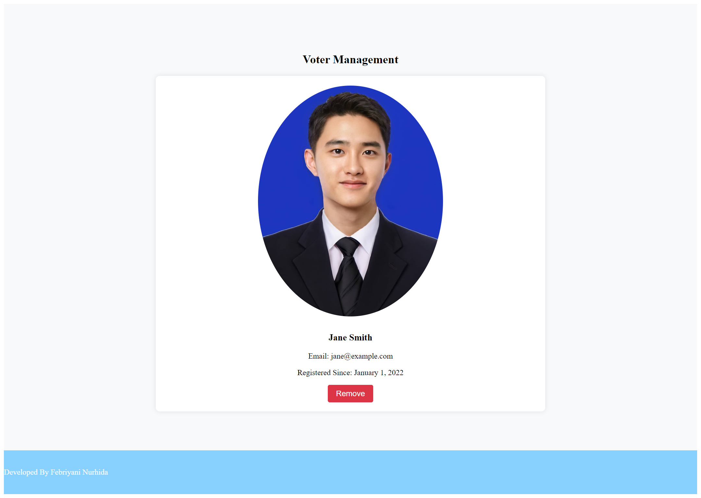

### admin mengakses election result:
```
<!DOCTYPE html>
<html lang="en">

<head>
    <meta charset="UTF-8">
    <meta name="viewport" content="width=device-width, initial-scale=1.0">
    <title>View Election Results - Admin Dashboard</title>
    <link rel="stylesheet" href="css/custom_style.css">
    <link rel="icon" href="images/icon.png" type="image/x-icon">
    <link rel="stylesheet" href="css/view_results_style.css"> <!-- Add your CSS file for this specific page -->
</head>
<style>
    /* Add your custom styles for the view results page here */

.admin-view-results {
    padding: 80px 0;
    background-color: #f8f9fa;
}

.container {
    max-width: 800px;
    margin: 0 auto;
}

h2 {
    text-align: center;
}

.result-summary {
    text-align: center;
    margin-bottom: 30px;
}

.detailed-results {
    display: flex;
    flex-wrap: wrap;
    gap: 20px;
    justify-content: center;
}

.result-item {
    text-align: center;
    background-color: #ffffff;
    padding: 20px;
    box-shadow: 0 0 10px rgba(0, 0, 0, 0.1);
    border-radius: 8px;
    flex: 1 0 calc(33.3333% - 20px);
    max-width: calc(33.3333% - 20px);
}

.progress-bar {
    background-color: rgb(136, 209, 255);
    height: 20px;
    border-radius: 4px;
    margin-top: 10px;
}

.footer-bawah {
    background-color: rgb(136, 209, 255);
    color: white;
    padding: 20px 0;
}

</style>
<body>

    <!-- Navbar -->
    <nav class="py-2 navbar navbar-expand-lg fixed-top">
        <!-- Navbar content goes here -->
    </nav>

    <!-- Page Content -->
    <section class="admin-view-results">
        <div class="container">
            <h2>Election Results</h2>

            <!-- Result Summary -->
            <div class="result-summary">
                <p>Total Votes Cast: 1000</p>
                <p>Winner: Candidate A</p>
                <p>Runner-up: Candidate B</p>
            </div>

            <!-- Detailed Results -->
            <div class="detailed-results">
                <!-- Sample result item, you can repeat this block for each candidate -->
                <div class="result-item">
                    <h3>Candidate A</h3>
                    <p>Total Votes: 600</p>
                    <div class="progress-bar" style="width: 60%;"></div>
                </div>

                <!-- Add more result items as needed -->

            </div>
        </div>
    </section>

    <!-- Footer -->
    <div class="footer-bawah">
        <p>
            Developed By Febriyani Nurhida
        </p>
    </div>

</body>

</html>
```

### output
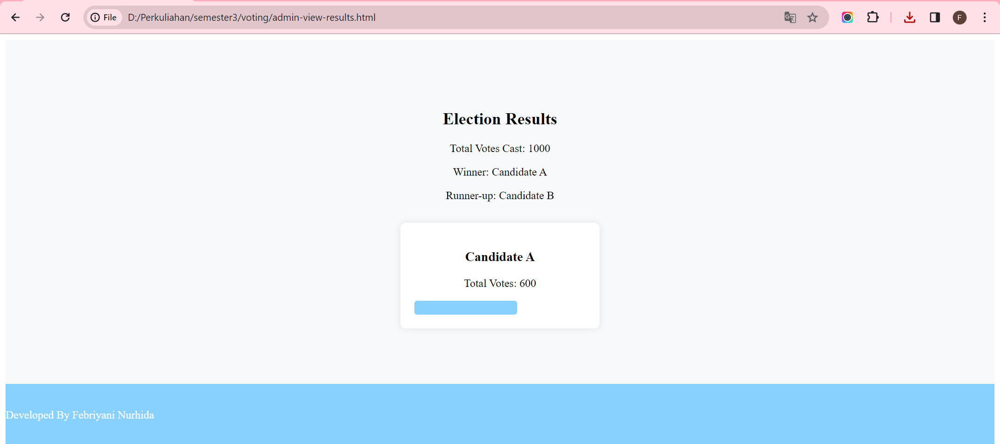

### admin mengklik pilihan log-out:
```
<!DOCTYPE html>
<html lang="en">

<head>
    <meta charset="UTF-8">
    <meta name="viewport" content="width=device-width, initial-scale=1.0">
    <title>Admin Logout</title>
    <link rel="stylesheet" href="css/custom_style.css">
    <link rel="icon" href="images/icon.png" type="image/x-icon">
</head>

<style>
    /* Add your custom styles for the logout page here */

    body {
        margin: 0;
        padding: 0;
        font-family: 'Arial', sans-serif;
        background-color: #f8f9fa;
        display: flex;
        align-items: center;
        justify-content: center;
        height: 100vh;
    }

    .logout-container {
        text-align: center;
        max-width: 400px;
        padding: 20px;
        background-color: #ffffff;
        box-shadow: 0 0 10px rgba(0, 0, 0, 0.1);
        border-radius: 8px;
    }

    h2 {
        margin-bottom: 20px;
    }

    .logout-btn {
        background-color: #dc3545;
        color: #fff;
        border: 1px solid #dc3545;
        padding: 10px 20px;
        font-size: 1rem;
        cursor: pointer;
        border-radius: 4px;
        text-decoration: none;
        display: inline-block;
    }

    .logout-btn:hover {
        background-color: #dc3545;
        color: #fff;
    }
</style>

<body>

    <div class="logout-container">
        <h2>Are you sure you want to logout?</h2>
        <button class="logout-btn" onclick="logout()">Logout</button>
    </div>

    <script>
        function logout() {
            // Redirect to the admin login page
            window.location.href = 'admin-login.html';
        }
    </script>

</body>

</html>
```

### outputnya :
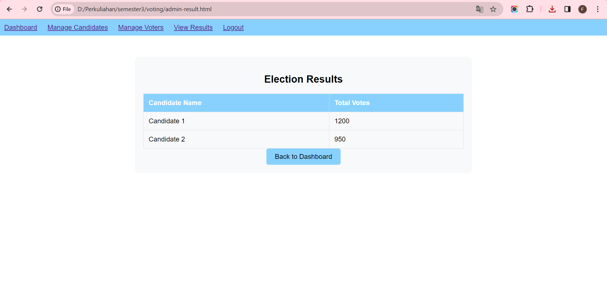

# setelah logout akan kembali ke tampilan log-in admin
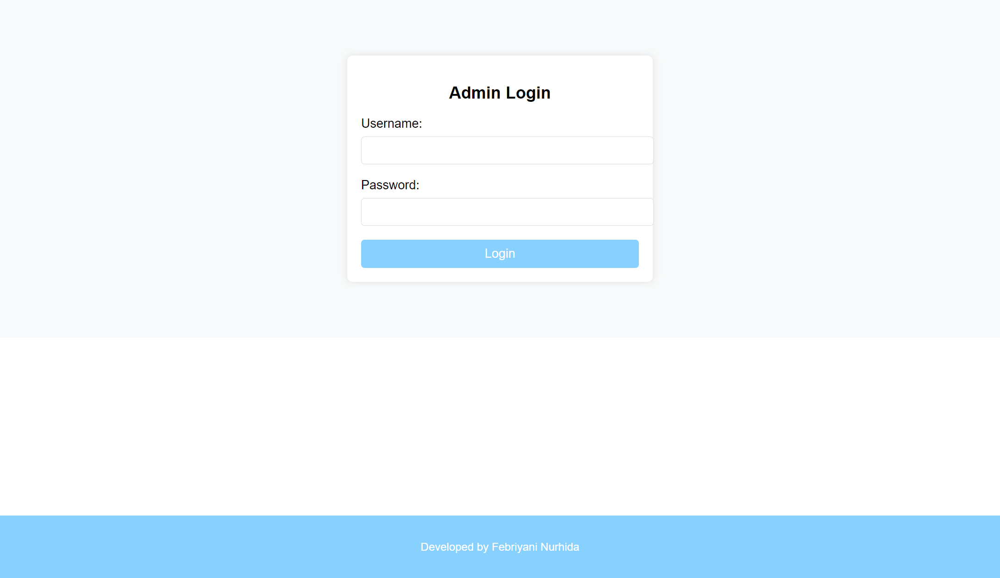

